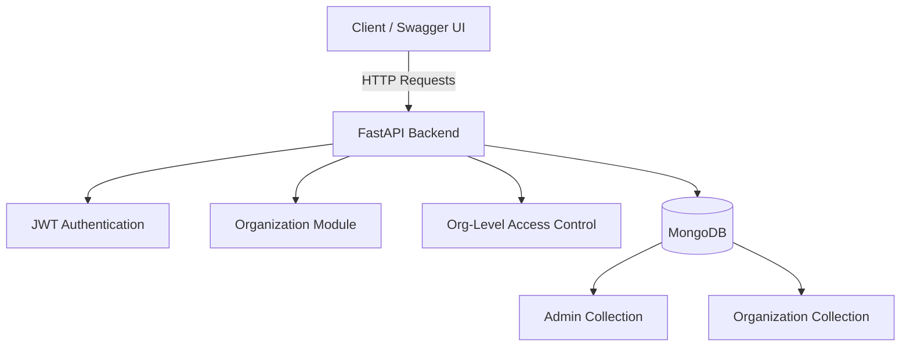

## TheWeddingCompany Backend — FastAPI + MongoDB

A backend service built using FastAPI + MongoDB, supporting dynamic organization creation where each organization receives:

1. Its own dedicated collection

2. Its own admin account

3. JWT-based authentication

4. CRUD operations

5. Protected organization-level access

**Swagger UI Execution of backend application**

*Works with fastAPIs inbuilt swagger documentation at http://127.0.0.1:8000/docs after execution in local machine port*

a. Logging in with Admin account

b. Copy the jwt access token for using update and delete operations (authenticated)

c. Click on the authenticate button and paste the copied access for authenticating (required for update and delete)

d. Create an Organization

e. Get Organization by Organization Name

f. Update the Organization (works only with Authentication)[*Here the authentication is blank because we have already filled authentication in button above*] 

copy the newly generated jwt token for future authentications

d. Delete the Organization (works only with Authentication)[*Here the authentication is blank because we have already filled authentication in button above*]

## High-Level Architecture Diagram

## Design Choices

- **FastAPI** is used for its high performance and automatic Swagger UI support.
- **MongoDB** enables flexible schemas and dynamic organization-specific collections.
- **JWT-based authentication** ensures secure, stateless access to protected endpoints.
- **Dedicated collections per organization** provide data isolation and better access control.
- **Swagger UI** allows easy testing of authentication and CRUD operations.

